# ArchiMate Viewpoints — Reference with PlantUML Examples

Each ArchiMate **viewpoint** is a diagram type aimed at a specific stakeholder concern.
This guide covers all **23 example viewpoints from the ArchiMate® 3.2 specification**, with:

- **Purpose** — what the diagram answers
- **When to use** — typical situation in practice
- **Key elements** — main element types you'll place
- **PlantUML example** — copy/paste starter using the built-in `archimate` stdlib

---

## How to render the PlantUML examples

PlantUML ships with a built-in ArchiMate sprite library. Every example begins with:

```plantuml
@startuml
!include <archimate/Archimate>
```

Render options:

| Method                   | How                                                            |
| ------------------------ | -------------------------------------------------------------- |
| Web (no install)         | https://www.plantuml.com/plantuml — paste code                 |
| VS Code extension        | Install **PlantUML** by jebbs; preview with `Alt+D`            |
| CLI                      | `plantuml diagram.puml` (requires Java + Graphviz)             |
| IntelliJ / JetBrains     | Install the PlantUML Integration plugin                        |
| Confluence / Markdown    | Use a PlantUML macro/plugin or render to PNG/SVG and embed     |

**Macro naming convention** (built-in stdlib `<archimate/Archimate>` — *CamelCase*):
`Layer_ElementType(alias, "Label")` — e.g., `Business_Actor(cust, "Customer")`.

> ⚠️ The community library `Archimate-PlantUML` (`!includeurl https://raw.githubusercontent.com/plantuml-stdlib/Archimate-PlantUML/...`) uses a slightly different `Snake_Case` naming (e.g., `Application_Data_Object`). Examples below target the **built-in stdlib** which uses CamelCase (`Application_DataObject`). Pick one library and stick with it.

---

## ArchiMate Layers (background)

| Layer                       | Concerns                                  |
| --------------------------- | ----------------------------------------- |
| **Strategy**                | Capabilities, resources, courses of action |
| **Business**                | Actors, processes, services, products      |
| **Application**             | Components, services, data objects         |
| **Technology**              | Nodes, devices, system software, networks  |
| **Physical**                | Equipment, facilities, materials           |
| **Motivation** (cross-cut)  | Drivers, goals, requirements, principles   |
| **Implementation & Migration** (cross-cut) | Work packages, plateaus, gaps |

---

# 1. Basic Viewpoints

## 1.1 Composition

### 1.1.1 Organization Viewpoint
**Purpose:** Show the structure of an organization — units, roles, responsibilities.
**When to use:** Identifying competencies, authority lines, who owns what.
**Key elements:** Business Actor, Business Role, Business Collaboration, Location.

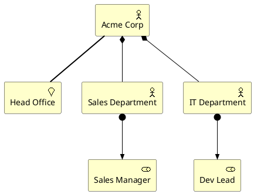

---

### 1.1.2 Information Structure Viewpoint
**Purpose:** Information used in the enterprise / business process / application.
**When to use:** Modeling business objects, data classes and their relationships.
**Key elements:** Business Object, Data Object, Representation, Meaning.

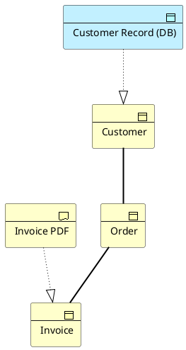

---

### 1.1.3 Technology Viewpoint
**Purpose:** Software & hardware technology supporting the Application Layer.
**When to use:** Documenting nodes, networks, system software platforms.
**Key elements:** Node, Device, System Software, Communication Network, Path.

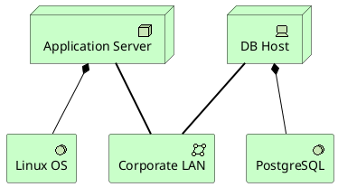

---

### 1.1.4 Layered Viewpoint
**Purpose:** Several layers and aspects in one big-picture diagram.
**When to use:** Communicating the overall architecture to a broad audience.
**Key elements:** Elements from Business, Application, and Technology layers.

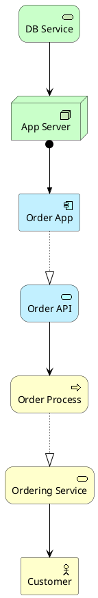

---

### 1.1.5 Physical Viewpoint
**Purpose:** Physical equipment, facilities, materials and distribution.
**When to use:** Manufacturing, logistics, IoT, plant operations.
**Key elements:** Equipment, Facility, Material, Distribution Network.

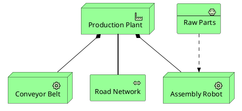

---

## 1.2 Support

### 1.2.1 Product Viewpoint
**Purpose:** Contents of a product offered to customers (services + contract).
**When to use:** Designing/modeling product portfolios.
**Key elements:** Product, Business Service, Contract, Value.

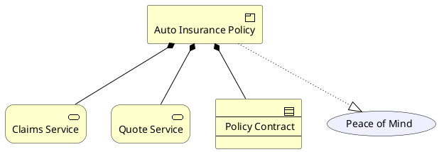

---

### 1.2.2 Application Usage Viewpoint
**Purpose:** How applications support business processes.
**When to use:** Showing what apps a process depends on.
**Key elements:** Business Process, Application Service, Application Component.

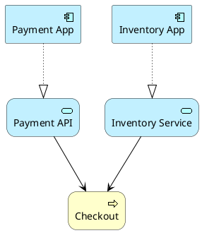

---

### 1.2.3 Technology Usage Viewpoint
**Purpose:** How technology supports applications.
**When to use:** Mapping apps to the infrastructure platforms that run them.
**Key elements:** Application Component, Technology Service, Node.

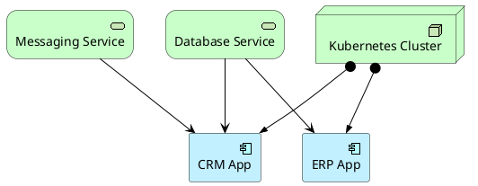

---

## 1.3 Cooperation

### 1.3.1 Business Process Cooperation Viewpoint
**Purpose:** How processes cooperate / depend on each other across units.
**When to use:** End-to-end process collaboration, hand-offs, shared data.
**Key elements:** Business Process, Business Event, Business Object, Business Actor.

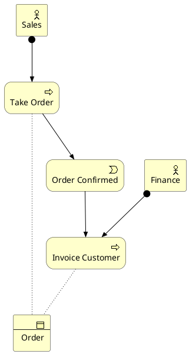

---

### 1.3.2 Application Cooperation Viewpoint
**Purpose:** Apps interacting via services; integration/collaboration relationships.
**When to use:** Integration architecture, API/messaging dependencies.
**Key elements:** Application Component, Application Service, Application Collaboration, Data Object.

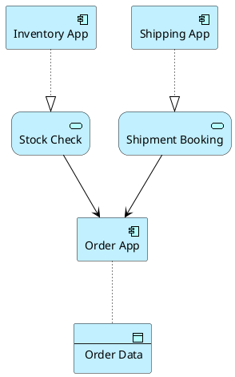

---

## 1.4 Realization

### 1.4.1 Service Realization Viewpoint
**Purpose:** How a business service is realized by processes / apps / actors.
**When to use:** Tracing value from a customer-facing service down to delivery.
**Key elements:** Business Service, Business Process, Business Actor, Application Service.

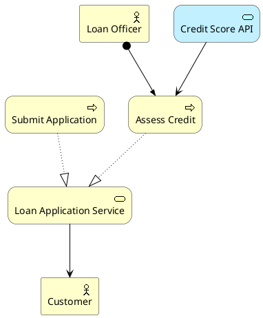

---

### 1.4.2 Implementation and Deployment Viewpoint
**Purpose:** How applications map to deployed artifacts on infrastructure.
**When to use:** Deployment architecture, build/release planning.
**Key elements:** Application Component, Artifact, Node.

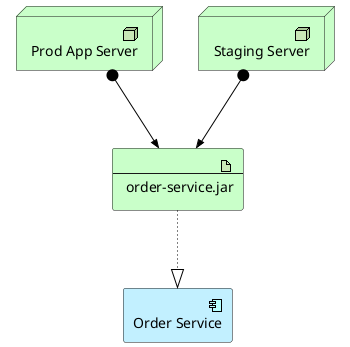

---

# 2. Motivation Viewpoints

## 2.1 Stakeholder Viewpoint
**Purpose:** Stakeholders, the drivers acting on them, and assessments.
**When to use:** Early architecture work — capturing concerns and priorities.
**Key elements:** Stakeholder, Driver, Assessment, Goal.

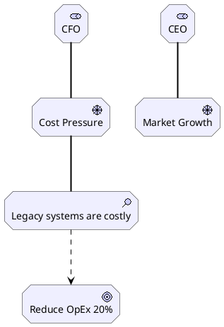

---

## 2.2 Goal Realization Viewpoint
**Purpose:** Refining goals into outcomes, requirements and principles.
**When to use:** Translating strategic intent into actionable requirements.
**Key elements:** Goal, Outcome, Requirement, Principle.

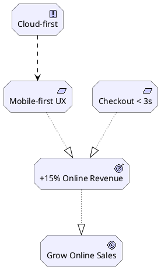

---

## 2.3 Requirements Realization Viewpoint
**Purpose:** Show how requirements are realized by core elements.
**When to use:** Connecting "why" elements to "what is built".
**Key elements:** Requirement, Goal, Business Service, Application Component.

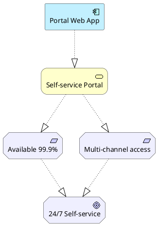

---

## 2.4 Motivation Viewpoint
**Purpose:** Combined view of all motivational concepts together.
**When to use:** A single page that captures the "why" of an initiative.
**Key elements:** Stakeholder, Driver, Assessment, Goal, Outcome, Requirement, Constraint, Principle, Value.

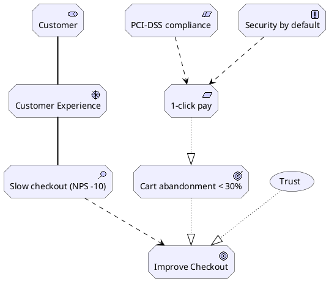

---

# 3. Strategy Viewpoints

## 3.1 Strategy Viewpoint
**Purpose:** High-level strategic direction — courses of action, capabilities, resources.
**When to use:** Strategy maps; aligning capabilities to business outcomes.
**Key elements:** Course of Action, Capability, Resource, Outcome.

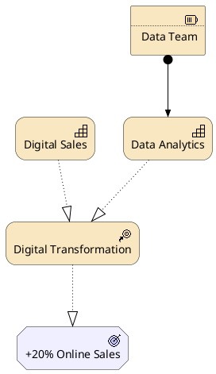

---

## 3.2 Capability Map Viewpoint
**Purpose:** A structured map of business capabilities (often heat-mapped).
**When to use:** Capability-based planning, gap & investment analysis.
**Key elements:** Capability (often nested), Course of Action.

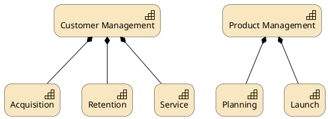

---

## 3.3 Outcome Realization Viewpoint
**Purpose:** Show how outcomes are produced by capabilities and processes.
**When to use:** Linking strategic outcomes to operational delivery.
**Key elements:** Outcome, Goal, Capability, Business Service, Stakeholder.

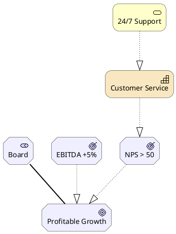

---

## 3.4 Resource Map Viewpoint
**Purpose:** Inventory of resources used by capabilities.
**When to use:** Resource allocation, capacity planning.
**Key elements:** Resource (often nested), Capability.

```plantuml
@startuml
!include <archimate/Archimate>

Strategy_Resource(people, "Workforce")
Strategy_Resource(devs, "Developers")
Strategy_Resource(designers, "UX Designers")
Strategy_Resource(infra, "Infrastructure")
Strategy_Resource(cloud, "Cloud Budget")
Strategy_Capability(buildCap, "Software Engineering")

Rel_Composition(people, devs)
Rel_Composition(people, designers)
Rel_Composition(infra, cloud)
Rel_Assignment(devs, buildCap)
Rel_Assignment(cloud, buildCap)
@enduml
```

---

# 4. Implementation & Migration Viewpoints

## 4.1 Project Viewpoint
**Purpose:** Programs, projects, deliverables and the people involved.
**When to use:** Roadmap planning, work breakdown.
**Key elements:** Work Package, Deliverable, Business Actor, Goal.

```plantuml
@startuml
!include <archimate/Archimate>

Business_Actor(pm, "Programme Manager")
Implementation_WorkPackage(prog, "Cloud Migration Programme")
Implementation_WorkPackage(wp1, "Lift & Shift CRM")
Implementation_WorkPackage(wp2, "Replatform ERP")
Implementation_Deliverable(d1, "CRM on AWS")
Implementation_Deliverable(d2, "ERP on Kubernetes")
Motivation_Goal(g, "Reduce TCO 30%")

Rel_Assignment(pm, prog)
Rel_Composition(prog, wp1)
Rel_Composition(prog, wp2)
Rel_Realization(wp1, d1)
Rel_Realization(wp2, d2)
Rel_Influence(prog, g)
@enduml
```

---

## 4.2 Migration Viewpoint
**Purpose:** Transition from baseline (As-Is) to target (To-Be) plateaus, with gaps.
**When to use:** Roadmaps, transformation planning.
**Key elements:** Plateau, Gap, Implementation Event.

```plantuml
@startuml
!include <archimate/Archimate>

Implementation_Plateau(asis, "Plateau: As-Is (2025)")
Implementation_Plateau(interim, "Plateau: Interim (2026 Q2)")
Implementation_Plateau(tobe, "Plateau: To-Be (2027)")
Implementation_Gap(gap1, "Gap: Legacy CRM")
Implementation_Gap(gap2, "Gap: On-prem ERP")

Rel_Triggering(asis, interim)
Rel_Triggering(interim, tobe)
Rel_Association(asis, gap1)
Rel_Association(interim, gap2)
@enduml
```

---

## 4.3 Implementation and Migration Viewpoint
**Purpose:** Combine programmes/projects with the plateaus and gaps they address.
**When to use:** Linking the "what" of transformation to the "when".
**Key elements:** Work Package, Deliverable, Plateau, Gap, Goal.

```plantuml
@startuml
!include <archimate/Archimate>

Motivation_Goal(g, "Cloud-First by 2027")
Implementation_Plateau(asis, "As-Is")
Implementation_Plateau(tobe, "To-Be: Cloud-Native")
Implementation_Gap(gap, "Legacy DC dependency")
Implementation_WorkPackage(wp, "DC Exit Programme")
Implementation_Deliverable(del, "All workloads in cloud")

Rel_Realization(tobe, g)
Rel_Triggering(asis, tobe)
Rel_Association(asis, gap)
Rel_Realization(wp, del)
Rel_Realization(del, tobe)
@enduml
```

---

# Appendix A — Picking the right viewpoint

| If you want to answer…                      | Use this viewpoint                |
| ------------------------------------------- | --------------------------------- |
| Why are we doing this?                      | Stakeholder / Motivation          |
| What outcome are we chasing?                | Goal Realization / Outcome Real.  |
| What capabilities do we need?               | Capability Map / Strategy         |
| What does the business look like?           | Organization                      |
| Who consumes which service?                 | Product / Application Usage       |
| How do processes hand off work?             | Business Process Cooperation      |
| How do apps integrate?                      | Application Cooperation           |
| What runs on what?                          | Technology Usage / Implementation & Deployment |
| What's the big picture?                     | Layered                           |
| How do we get from A to B?                  | Migration / Implementation & Migration |
| How is X service realized end-to-end?       | Service Realization               |

---

# Appendix B — Relationship cheat sheet (built-in stdlib)

| Macro                  | Meaning                              | ArchiMate notation              |
| ---------------------- | ------------------------------------ | ------------------------------- |
| `Rel_Composition`      | "is part of" (strong)                | line with **filled diamond**    |
| `Rel_Aggregation`      | "groups" (weak)                      | line with **open diamond**      |
| `Rel_Assignment`       | actor performs / node hosts          | line with **solid endpoints**   |
| `Rel_Realization`      | realizes a higher-level concept      | dashed line with **hollow triangle** |
| `Rel_Serving`          | "serves / is used by" (provider→consumer) | solid line with open arrow |
| `Rel_Triggering`       | causal/temporal trigger              | solid arrow with filled head    |
| `Rel_Flow`             | flow of information/value            | dashed arrow                    |
| `Rel_Access`           | reads/writes data (`_r`/`_w`/`_rw`)  | dashed arrow with open arrow    |
| `Rel_Influence`        | positive/negative influence (`+`/`-`) | dashed arrow with `+`/`-` label |
| `Rel_Specialization`   | "is a kind of"                       | line with **hollow triangle**   |
| `Rel_Association`      | generic link (undirected)            | plain line                      |
| `Rel_Association_dir`  | directed association                 | plain line with arrow           |

> Direction modifier: append `_Up`, `_Down`, `_Left`, `_Right` to any macro to control layout
> (e.g., `Rel_Composition_Up(child, parent)`).

---

# Appendix C — Element macro cheat sheet (built-in stdlib)

| Layer          | Macros (CamelCase)                                                                                                                       |
| -------------- | ---------------------------------------------------------------------------------------------------------------------------------------- |
| Business       | `Business_Actor`, `Business_Role`, `Business_Collaboration`, `Business_Interface`, `Business_Process`, `Business_Function`, `Business_Interaction`, `Business_Event`, `Business_Service`, `Business_Object`, `Business_Contract`, `Business_Representation`, `Business_Product`, `Business_Location` |
| Application    | `Application_Component`, `Application_Collaboration`, `Application_Interface`, `Application_Function`, `Application_Interaction`, `Application_Process`, `Application_Event`, `Application_Service`, `Application_DataObject` |
| Technology     | `Technology_Node`, `Technology_Device`, `Technology_SystemSoftware`, `Technology_Collaboration`, `Technology_Interface`, `Technology_Path`, `Technology_CommunicationNetwork`, `Technology_Function`, `Technology_Process`, `Technology_Interaction`, `Technology_Event`, `Technology_Service`, `Technology_Artifact` |
| Physical       | `Physical_Equipment`, `Physical_Facility`, `Physical_DistributionNetwork`, `Physical_Material` |
| Motivation     | `Motivation_Stakeholder`, `Motivation_Driver`, `Motivation_Assessment`, `Motivation_Goal`, `Motivation_Outcome`, `Motivation_Principle`, `Motivation_Requirement`, `Motivation_Constraint`, `Motivation_Meaning`, `Motivation_Value` |
| Strategy       | `Strategy_Resource`, `Strategy_Capability`, `Strategy_CourseOfAction`, `Strategy_ValueStream` |
| Implementation | `Implementation_WorkPackage`, `Implementation_Deliverable`, `Implementation_Event`, `Implementation_Plateau`, `Implementation_Gap` |
| Other          | `Junction_Or`, `Junction_And`, `Grouping`, `Group`, `Boundary`, `Other_Location`, `Other_Grouping` |

---

# Appendix D — Authoring tips

1. **Start from a stakeholder concern** — pick the viewpoint that answers *their* question, not your favourite one.
2. **One viewpoint = one story.** If a diagram needs three legends, split it.
3. **Layer top-down.** Motivation/Strategy on top, Business in the middle, Application/Technology at the bottom.
4. **Stay element-consistent.** Don't put an Application Component inside a Business layer view unless you have a reason.
5. **Use colour by layer**, not by status. (Red ≠ "old"; use Plateaus or Gaps for time.)
6. **Give every diagram a title and a date.** Architectures decay — readers need to know what's stale.
7. **Validate relationships.** ArchiMate is strict: e.g., a Business Process *realizes* a Service; it does not *compose* one.
8. **Mind the Serving direction.** `Rel_Serving(provider, consumer)` — arrow points from the provider to the consumer.

---

*Spec reference: The Open Group — ArchiMate® 3.2 Specification, "Example Viewpoints" (Appendix C, 23 viewpoints).*
*PlantUML reference: built-in `<archimate/Archimate>` stdlib (`github.com/plantuml/plantuml-stdlib/blob/master/stdlib/archimate/Archimate.puml`).*
