# UML Diagrams — Reference with PlantUML Examples

Each entry covers one of the **14 official UML 2.5.1 diagram types**, organized into:

- **Structural diagrams** (7) — describe what *exists* in the system at a moment in time.
- **Behavioral diagrams** (7) — describe what *happens* in the system over time.

For every diagram you'll find:

- **Purpose** — what it answers
- **When to use** — typical situation in practice
- **Key elements** — the main element types
- **Rendered diagram** — auto-generated from the matching `diagrams_uml/*.puml` file
- **PlantUML source** — collapsible block showing the code

> 📁 **Source of truth:** the `.puml` files in [`diagrams_uml/`](diagrams_uml/). Edit those — the SVGs are regenerated by the GitHub Action in `.github/workflows/render-diagrams.yml` (which also covers `diagrams/` for ArchiMate).

---

## How the rendering pipeline works

```
diagrams_uml/NN-name.puml  ──(GitHub Action: plantuml -tsvg)──▶  diagrams_uml/NN-name.svg
                                                                          │
                                                                          ▼
                                                  this README embeds it via 
```

To render locally:

```bash
# one-time
curl -sSL -o plantuml.jar https://github.com/plantuml/plantuml/releases/latest/download/plantuml.jar
sudo apt install graphviz   # or: brew install graphviz

# render all
java -jar plantuml.jar -tsvg -o . diagrams_uml/*.puml
```

In your editor:
- **VS Code** → install **PlantUML** by jebbs; press `Alt+D` for live preview.
- **IntelliJ / JetBrains** → install the PlantUML Integration plugin.

> 💡 PlantUML *natively* supports most UML diagrams. A few (Communication, Interaction Overview, Profile) require a creative use of related syntaxes — those are noted inline.

---

## The 14 UML 2.5.1 diagram types at a glance

| #   | Diagram                       | Family                       | Answers…                                     |
| --- | ----------------------------- | ---------------------------- | -------------------------------------------- |
| 1   | Class                         | Structural                   | What classes exist and how do they relate?   |
| 2   | Object                        | Structural                   | A snapshot of instances at a point in time   |
| 3   | Component                     | Structural                   | What components exist and how are they wired? |
| 4   | Composite Structure           | Structural                   | Internal parts of a class / component        |
| 5   | Deployment                    | Structural                   | What runs where (nodes, artifacts)?          |
| 6   | Package                       | Structural                   | How is the codebase organized?               |
| 7   | Profile                       | Structural                   | Custom stereotypes / domain-specific UML     |
| 8   | Use Case                      | Behavioral                   | Who does what with the system?               |
| 9   | Activity                      | Behavioral                   | Step-by-step workflow with branches & forks  |
| 10  | State Machine                 | Behavioral                   | How does an object change state?             |
| 11  | Sequence                      | Behavioral › **Interaction** | Time-ordered messages between participants   |
| 12  | Communication                 | Behavioral › **Interaction** | Same as sequence, organized by structure     |
| 13  | Interaction Overview          | Behavioral › **Interaction** | High-level flow of multiple sequences        |
| 14  | Timing                        | Behavioral › **Interaction** | State changes against an explicit timeline   |

> 🛈 In the official UML 2.5.1 taxonomy, diagrams 11–14 are grouped under the sub-category **"Interaction diagrams"** within Behavioral diagrams.

---

# Part 1 — Structural Diagrams

## 1. Class Diagram
**Purpose:** Show the static structure — classes, attributes, operations, and their relationships.
**When to use:** Domain modeling, designing OO systems, documenting an existing codebase.
**Key elements:** Class, Interface, Abstract Class, Attribute, Operation, Generalization, Association (incl. aggregation/composition), Realization, Dependency, Multiplicity.

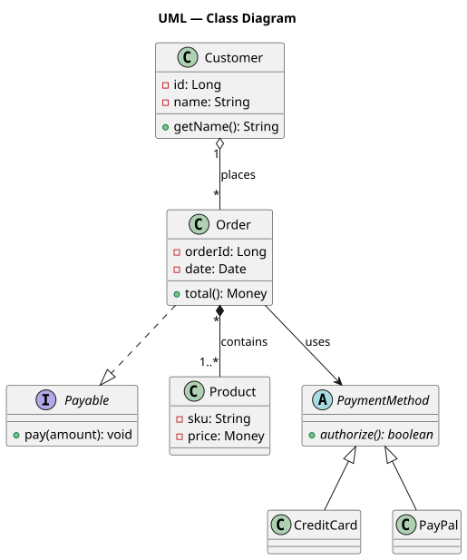

<details><summary>PlantUML source — <a href="diagrams_uml/01-class.puml"><code>diagrams_uml/01-class.puml</code></a></summary>

```plantuml
@startuml
interface Payable { + pay(amount): void }
class Customer {
  - id: Long
  - name: String
  + getName(): String
}
class Order {
  - orderId: Long
  - date: Date
  + total(): Money
}
class Product { - sku: String; - price: Money }
abstract class PaymentMethod { + {abstract} authorize(): boolean }
class CreditCard
class PayPal

PaymentMethod <|-- CreditCard
PaymentMethod <|-- PayPal
Order ..|> Payable
Customer "1" o-- "*" Order : places
Order "*" *-- "1..*" Product : contains
Order --> PaymentMethod : uses
@enduml
```

</details>

> Key relationship glyphs: `<|--` generalization · `..|>` realization · `*--` composition · `o--` aggregation · `-->` association · `..>` dependency.

---

## 2. Object Diagram
**Purpose:** A snapshot of *instances* (objects with concrete values) at a moment in time.
**When to use:** Validating a class diagram with a worked example; debugging or testing scenarios.
**Key elements:** Instance Specification, Slot (attribute = value), Link.

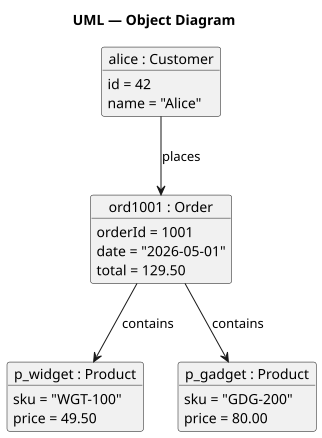

<details><summary>PlantUML source — <a href="diagrams_uml/02-object.puml"><code>diagrams_uml/02-object.puml</code></a></summary>

```plantuml
@startuml
object "alice : Customer" as alice {
  id = 42
  name = "Alice"
}
object "ord1001 : Order" as ord1 {
  orderId = 1001
  date = "2026-05-01"
  total = 129.50
}
object "p_widget : Product" as p1 { sku = "WGT-100"; price = 49.50 }
object "p_gadget : Product" as p2 { sku = "GDG-200"; price = 80.00 }

alice --> ord1 : places
ord1  --> p1   : contains
ord1  --> p2   : contains
@enduml
```

</details>

---

## 3. Component Diagram
**Purpose:** Logical components and the interfaces they require/provide; how they wire together.
**When to use:** Application architecture, microservice topology, library boundaries.
**Key elements:** Component, Interface (provided/required, "lollipop" + "socket"), Port, Connector.

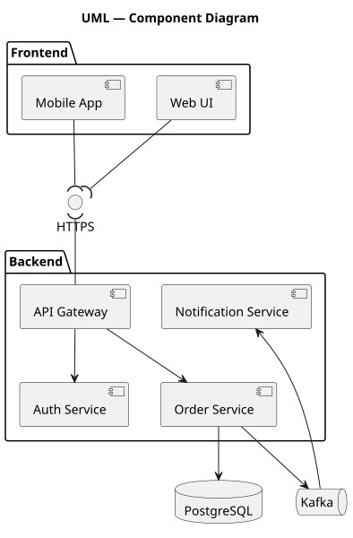

<details><summary>PlantUML source — <a href="diagrams_uml/03-component.puml"><code>diagrams_uml/03-component.puml</code></a></summary>

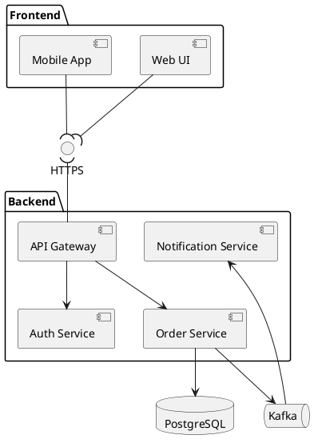

</details>

---

## 4. Composite Structure Diagram
**Purpose:** Internal structure of a class/component — its parts, ports, and how parts are connected.
**When to use:** Designing complex aggregates (e.g., a `Car` made of `Engine`, `Wheel[4]`, `Transmission`).
**Key elements:** Part (role within an enclosing classifier), Port, Connector, Multiplicity.

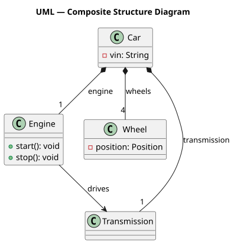

<details><summary>PlantUML source — <a href="diagrams_uml/04-composite-structure.puml"><code>diagrams_uml/04-composite-structure.puml</code></a></summary>

```plantuml
@startuml
class Car { - vin: String }
class Engine { + start(): void; + stop(): void }
class Wheel { - position: Position }
class Transmission

Car *-- "1" Engine        : engine
Car *-- "4" Wheel         : wheels
Car *-- "1" Transmission  : transmission
Engine --> Transmission   : drives
@enduml
```

</details>

---

## 5. Deployment Diagram
**Purpose:** Physical (or virtual) deployment topology — what artifacts run on what nodes.
**When to use:** Infrastructure design, runtime documentation, "what's where" reviews.
**Key elements:** Node (device, server, container), Artifact (deployable: jar/war/image), Communication Path.

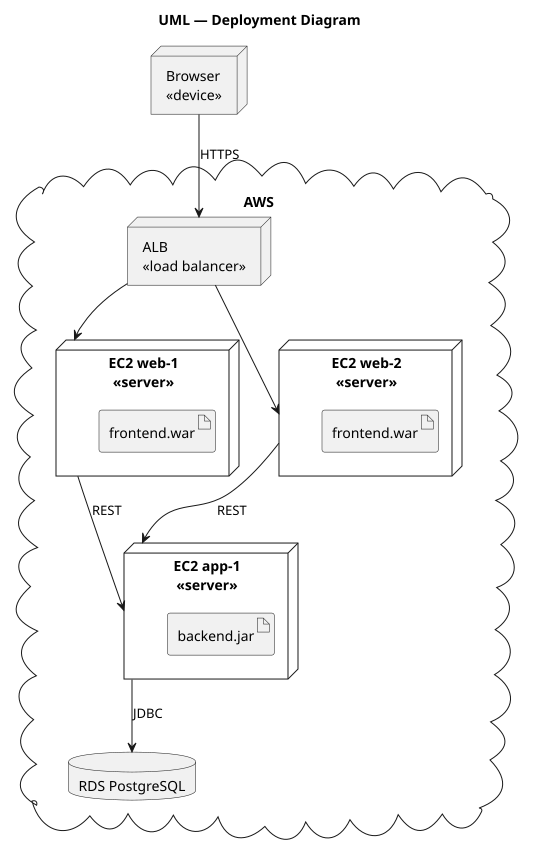

<details><summary>PlantUML source — <a href="diagrams_uml/05-deployment.puml"><code>diagrams_uml/05-deployment.puml</code></a></summary>

```plantuml
@startuml
node "Browser\n<<device>>" as browser
cloud "AWS" {
  node "ALB\n<<load balancer>>" as lb
  node "EC2 web-1\n<<server>>" as web1 { artifact "frontend.war" }
  node "EC2 web-2\n<<server>>" as web2 { artifact "frontend.war" as fw2 }
  node "EC2 app-1\n<<server>>" as app1 { artifact "backend.jar" }
  database "RDS PostgreSQL" as db
}
browser --> lb : HTTPS
lb --> web1
lb --> web2
web1 --> app1 : REST
web2 --> app1 : REST
app1 --> db   : JDBC
@enduml
```

</details>

---

## 6. Package Diagram
**Purpose:** Group elements into namespaces and show dependencies between groups.
**When to use:** Codebase organization, layering rules, dependency direction enforcement.
**Key elements:** Package, Dependency (`«import»`, `«access»`), Merge.

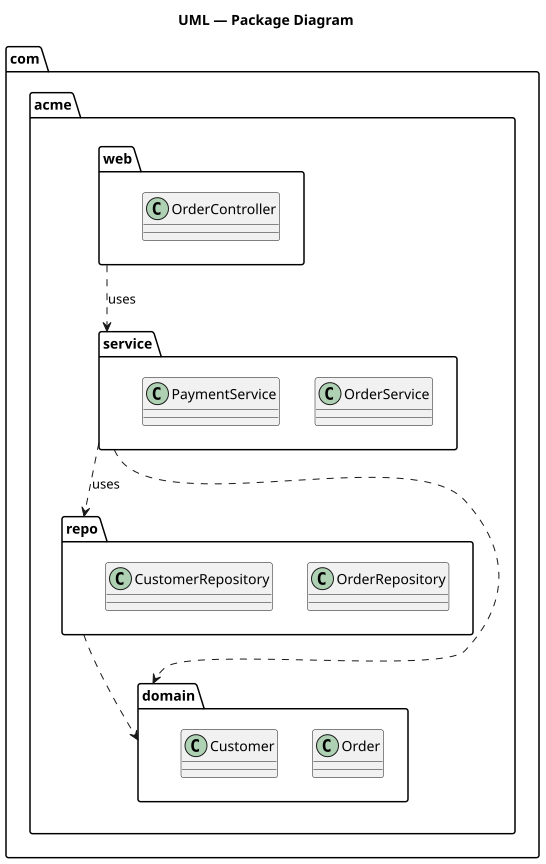

<details><summary>PlantUML source — <a href="diagrams_uml/06-package.puml"><code>diagrams_uml/06-package.puml</code></a></summary>

```plantuml
@startuml
package "com.acme.web"     { class OrderController }
package "com.acme.service" { class OrderService; class PaymentService }
package "com.acme.repo"    { class OrderRepository; class CustomerRepository }
package "com.acme.domain"  { class Order; class Customer }

"com.acme.web"     ..> "com.acme.service" : uses
"com.acme.service" ..> "com.acme.repo"    : uses
"com.acme.service" ..> "com.acme.domain"
"com.acme.repo"    ..> "com.acme.domain"
@enduml
```

</details>

---

## 7. Profile Diagram
**Purpose:** Define a *profile* — a set of custom stereotypes that extend UML for a specific domain.
**When to use:** Modeling Java EE, Spring, SysML, or any domain-specific extension of UML.
**Key elements:** Profile, Stereotype, Tagged Value, Metaclass extension.

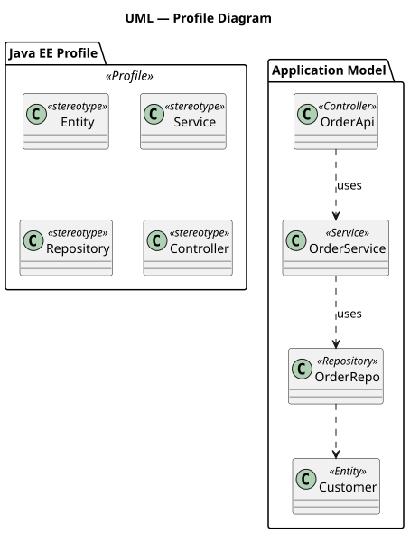

<details><summary>PlantUML source — <a href="diagrams_uml/07-profile.puml"><code>diagrams_uml/07-profile.puml</code></a></summary>

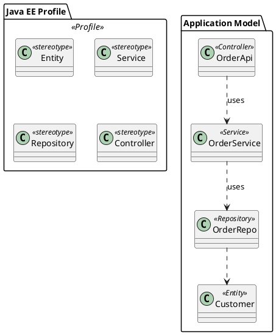

</details>

> PlantUML has no first-class profile syntax — we model profiles as a package of stereotype classes plus consumers tagged with `<<Stereotype>>`.

---

# Part 2 — Behavioral Diagrams

## 8. Use Case Diagram
**Purpose:** Show what the system does from an *actor's* point of view, at a glance.
**When to use:** Requirements elicitation, scoping, stakeholder alignment.
**Key elements:** Actor (human or external system), Use Case, System Boundary, `«include»`, `«extend»`, Generalization.

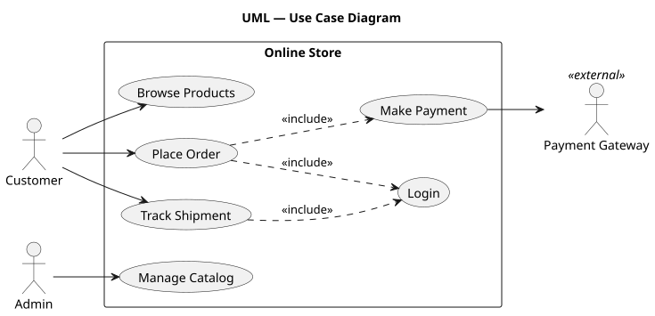

<details><summary>PlantUML source — <a href="diagrams_uml/08-use-case.puml"><code>diagrams_uml/08-use-case.puml</code></a></summary>

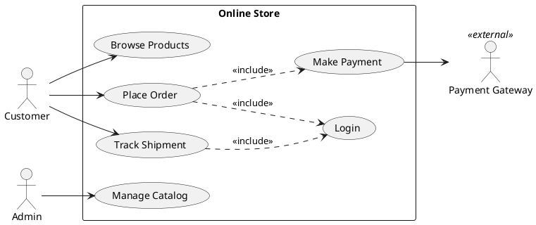

</details>

---

## 9. Activity Diagram
**Purpose:** Workflow with branches, parallelism, and merges — like a flowchart with explicit semantics.
**When to use:** Business processes, algorithms, multi-step user flows.
**Key elements:** Action, Decision/Merge, Fork/Join, Initial/Final node, Swimlane (Partition), Object node.

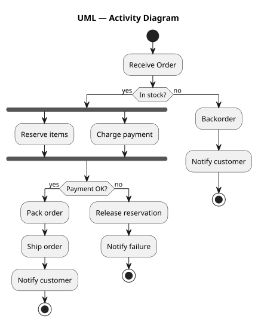

<details><summary>PlantUML source — <a href="diagrams_uml/09-activity.puml"><code>diagrams_uml/09-activity.puml</code></a></summary>

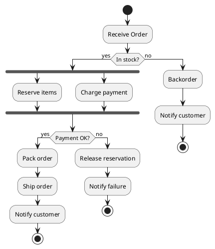

</details>

---

## 10. State Machine Diagram
**Purpose:** Lifecycle of a single object — its states and the events that move it between them.
**When to use:** Order status, document approval, hardware modes, protocol state.
**Key elements:** State (incl. composite/nested), Initial/Final pseudo-states, Transition, Event, Guard, Action.

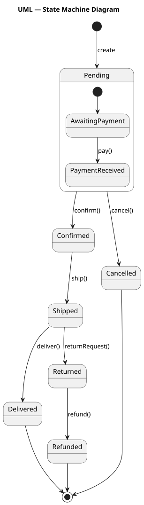

<details><summary>PlantUML source — <a href="diagrams_uml/10-state-machine.puml"><code>diagrams_uml/10-state-machine.puml</code></a></summary>

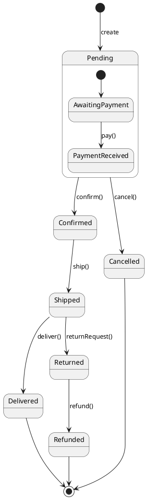

</details>

---

## 11. Sequence Diagram
**Purpose:** Time-ordered messages between participants.
**When to use:** API call flows, protocol exchanges, "tell the story of one request".
**Key elements:** Lifeline, Message (sync/async), Activation/Execution Specification, Combined Fragments (`alt`, `loop`, `par`, `opt`).

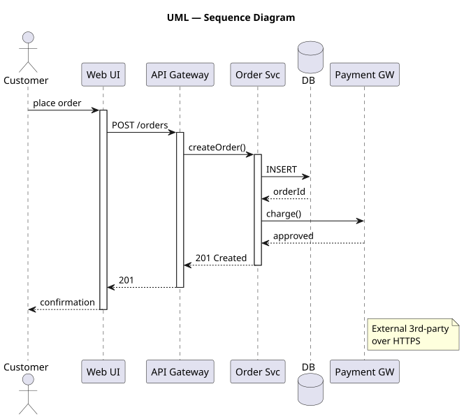

<details><summary>PlantUML source — <a href="diagrams_uml/11-sequence.puml"><code>diagrams_uml/11-sequence.puml</code></a></summary>

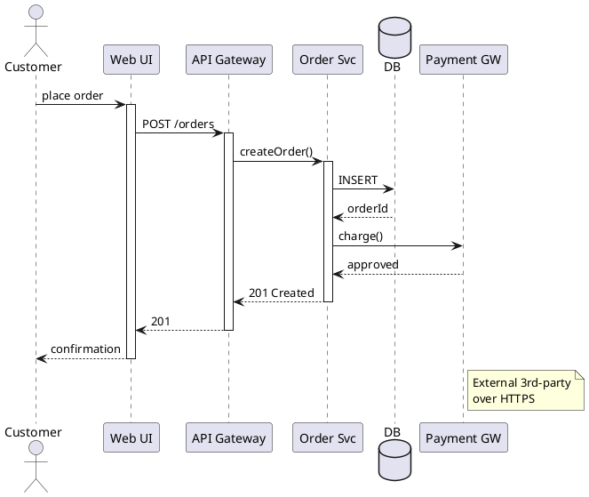

</details>

---

## 12. Communication Diagram
**Purpose:** Same information as a sequence diagram, but laid out by structural relationships with **numbered** messages.
**When to use:** Emphasizing which objects talk to which (topology) over the temporal ordering.
**Key elements:** Object, Link, Numbered Message.

> 🛈 *Historical note:* Communication diagrams were called **"Collaboration diagrams"** in UML 1.x — you'll still see that term in older texts.

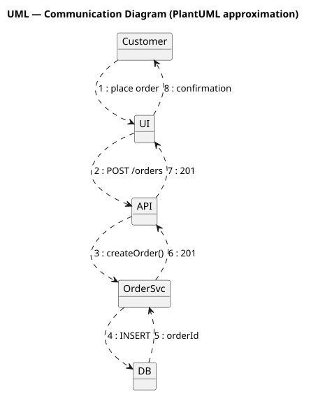

<details><summary>PlantUML source — <a href="diagrams_uml/12-communication.puml"><code>diagrams_uml/12-communication.puml</code></a></summary>

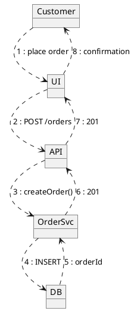

</details>

> 🛈 PlantUML has no native communication-diagram type — for production work many teams just use a sequence diagram instead.

---

## 13. Interaction Overview Diagram
**Purpose:** A *high-level* view that mixes activity-flow nodes with references to sub-sequence diagrams.
**When to use:** Showing how multiple sequences chain together at a workflow level.
**Key elements:** Initial/Final, Decision, Fork/Join, Interaction Use (`ref` to a sequence), Interaction inline.

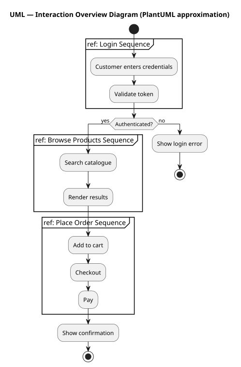

<details><summary>PlantUML source — <a href="diagrams_uml/13-interaction-overview.puml"><code>diagrams_uml/13-interaction-overview.puml</code></a></summary>

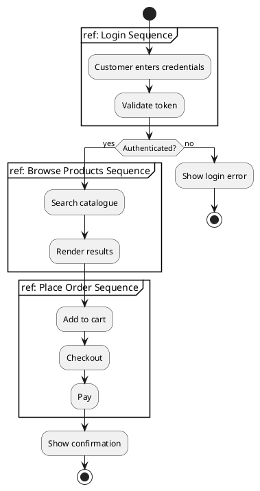

</details>

---

## 14. Timing Diagram
**Purpose:** State changes (or values) plotted against an explicit timeline.
**When to use:** Real-time/embedded systems, performance traces, protocol timing constraints.
**Key elements:** Lifeline, State Timeline, Value Timeline, Time Constraint, Duration Constraint, Event mark.

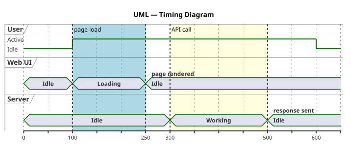

<details><summary>PlantUML source — <a href="diagrams_uml/14-timing.puml"><code>diagrams_uml/14-timing.puml</code></a></summary>

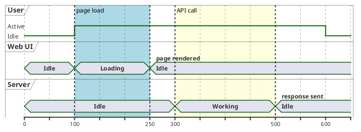

</details>

---

# Appendix A — Picking the right UML diagram

| If you want to answer…                              | Use this diagram        |
| --------------------------------------------------- | ----------------------- |
| What classes / data shapes do we have?              | Class                   |
| Show me a concrete example of those classes         | Object                  |
| What components/services exist and how are they wired? | Component            |
| What's *inside* this complex class?                 | Composite Structure     |
| What runs on what server / container / device?      | Deployment              |
| How is the codebase organized into modules?         | Package                 |
| I'm extending UML for a domain (Java EE, SysML…)    | Profile                 |
| Who interacts with the system, and to do what?      | Use Case                |
| Walk me through this multi-step workflow            | Activity                |
| How does an order/document move through its lifecycle? | State Machine        |
| Show the messages exchanged for one request         | Sequence                |
| Same as sequence but emphasize topology             | Communication           |
| Big-picture flow that chains several sequences      | Interaction Overview    |
| Timing & duration of state changes                  | Timing                  |

---

# Appendix B — PlantUML cheat sheet (UML)

### Class-diagram relationships
| Glyph    | Meaning                  |
| -------- | ------------------------ |
| `<\|--`  | Generalization (extends) |
| `..\|>`  | Realization (implements) |
| `*--`    | Composition              |
| `o--`    | Aggregation              |
| `-->`    | Association (directed)   |
| `--`     | Association (plain)      |
| `..>`    | Dependency               |
| `..`     | Link / dotted association |

### Sequence-diagram message arrows
| Glyph   | Meaning                |
| ------- | ---------------------- |
| `->`    | Synchronous message    |
| `-->`   | Reply message          |
| `->>`   | Asynchronous message   |
| `-\\`   | Lost / found message   |

### Common keywords
| Keyword                    | Use in…                     |
| -------------------------- | --------------------------- |
| `class`, `interface`, `abstract`, `enum` | Class diagram |
| `object`                   | Object / communication       |
| `actor`, `usecase`, `rectangle` | Use case               |
| `start`, `stop`, `if … then … else …`, `fork … end fork`, `partition` | Activity |
| `state`, `[*]`             | State machine                |
| `participant`, `database`, `queue`, `actor`, `note`, `activate`/`deactivate`, `alt`/`loop`/`par` | Sequence |
| `node`, `artifact`, `cloud`, `database` | Deployment      |
| `package`, `<<stereotype>>` | Package / profile           |
| `robust`, `concise`, `@<time>`, `is`, `highlight` | Timing  |

---

# Appendix C — Authoring tips

1. **One purpose per diagram.** A class diagram is for static structure; don't smuggle runtime behavior into it.
2. **Less is more.** Show the 5–10 elements that matter; cut the rest. UML diagrams that try to be the whole system are unread.
3. **Name things from the reader's vocabulary.** Domain terms beat abbreviations, even at the cost of length.
4. **Be deliberate about direction.** `→` should mean something concrete (depends on, sends to, derives). Don't draw lines for connectivity's sake.
5. **State machines: every state has a way out.** Dead-end states are nearly always bugs.
6. **Sequence diagrams: keep the happy path on the main page.** Move error/edge flows to a second diagram.
7. **Deployment diagrams age fast.** Add a date and a "last verified" note — or generate them from infra-as-code.
8. **Match diagram type to the question.** When unsure, ask the reader: "Are you asking *what exists* or *what happens*?"

---

*Spec reference: OMG — Unified Modeling Language (UML) version 2.5.1, "Diagrams" taxonomy.*
*PlantUML reference: <https://plantuml.com> (Class, Sequence, Use Case, Activity, State, Component, Deployment, Object, Package, Timing diagram pages).*
