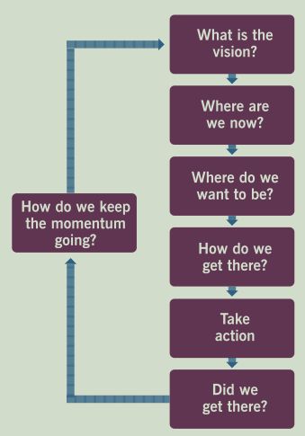

# The Power of Lifecycle Thinking

After two weeks preparing for my ITIL certificate, one diagram stood out above everything else -- what I like to call the **Lifecycle of Change**.

The moment I saw it, I thought: this is exactly what the lifecycle of change is about.

## Lifecycles Are Everywhere

The word "lifecycle" appears across every discipline. In **data management**, the lifecycle governs creation, storage, usage, and deletion. In **project management**, it guides us from initiation through execution to closure -- skip monitoring, and scope creep kills your timeline.

This diagram from ITIL reminds us that change is never a one-time event. The common thread? **Every lifecycle is a cycle, not a line.** Most frameworks get the linear steps right: define a goal, make a plan, execute, review. But the real value lies in the final question: *How do we keep the momentum going?* It forces you to ask not just "did we succeed?" but "how do we sustain this?" -- and feeds that answer right back into a renewed vision.

#ITIL #ChangeManagement #LifecycleManagement #ProjectManagement #DataManagement #ContinuousImprovement #ITServiceManagement
